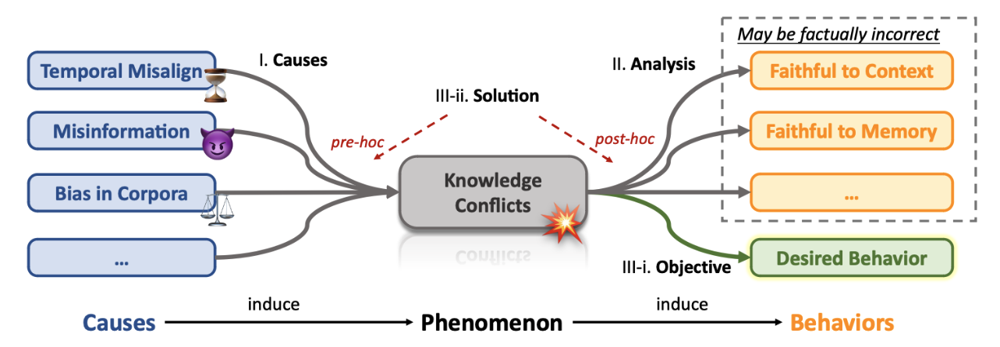

# 💥Knowledge Conflicts for LLMs: A Survey

---

This is the repository for the survey paper: [Knowledge Conflicts for LLMs: A Survey](https://arxiv.org/abs/2403.08319).

Rongwu Xu1*, Zehan Qi1*, Zhijiang Guo2, Cunxiang Wang3, Hongru Wang4, Yue Zhang3 and Wei Xu1.

 

1. Tsinghua University; 2. University of Cambridge; 3. Westlake University; 4. Chinese University of Hong Kong. 
 (*: Equal Contribution)

 

## Recap

We investigate **three** types of knowledge conflicts: context-memory conflict, inter-context conflict, and intra-memory conflict.

- **Context-memory conflict:** Contextual knowledge (context) can conflict with the parametric knowledge (memory) encapsulated within the LLM's parameters.
- **Inter-context conflict:** Conflict among various pieces of contextual knowledge (e.g., noise, outdated information, misinformation, etc.).
- **Intra-memory conflict:** LLM's parametric knowledge may yield divergent responses to differently phrased queries, which can be attributed to the conflicting knowledge embedded within the LLM's parameters.

This survey reviews the literature on the causes, behaviors, and possible solutions to knowledge conflicts.

##  Star History  

