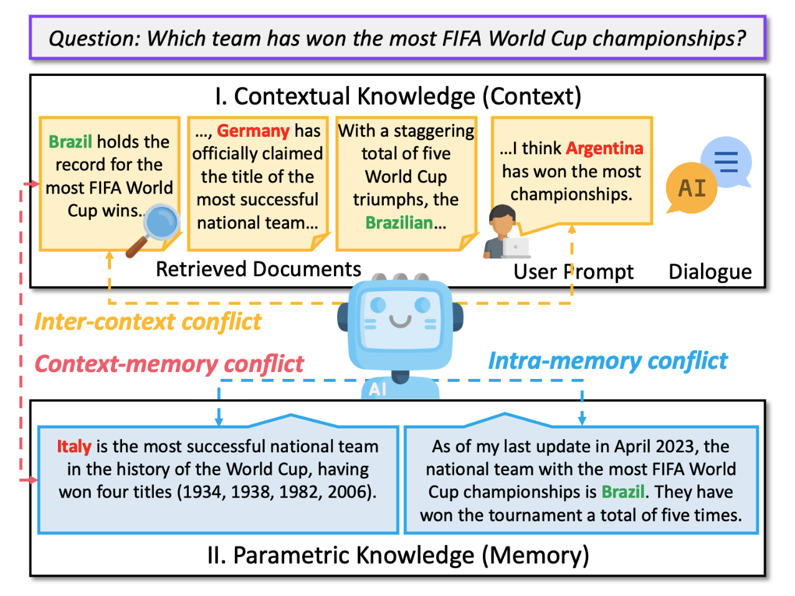

# 💥Knowledge Conflicts for LLMs: A Survey


This is the repository for the survey paper: [Knowledge Conflicts for LLMs: A Survey](https://arxiv.org/abs/2403.08319). 

🌟Star us for future lookups!🌟

<p align="center">
 <br>
</p> 

<p align="center">
<strong>
Rongwu Xu<sup>1</sup>*, Zehan Qi<sup>1</sup>*, Zhijiang Guo<sup>2</sup>, Cunxiang Wang<sup>3</sup>, Hongru Wang<sup>4</sup>, Yue Zhang<sup>3</sup> and Wei Xu<sup>1</sup>
</strong>
</p> 

<p align="center">
1. Tsinghua University; 2. University of Cambridge; 3. Westlake University; 4. The Chinese University of Hong Kong<br>
 (* Equal Contribution)
</p> 

## 📝 Citation

If you find our survey useful, please consider citing:
``` bib
@article{xu2024knowledge,
  title={Knowledge Conflicts for LLMs: A Survey},
  author={Xu, Rongwu and Qi, Zehan and Wang, Cunxiang and Wang, Hongru and Zhang, Yue and Xu, Wei},
  journal={arXiv preprint arXiv:2403.08319},
  year={2024}
}
```

## ❤️ Recap

We investigate **three** types of knowledge conflicts: context-memory conflict, inter-context conflict, and intra-memory conflict.

- **Context-memory conflict:** Contextual knowledge (context) can conflict with the parametric knowledge (memory) encapsulated within the LLM's parameters.
- **Inter-context conflict:** Conflict among various pieces of contextual knowledge (e.g., noise, outdated information, misinformation, etc.).
- **Intra-memory conflict:** LLM's parametric knowledge may yield divergent responses to differently phrased queries, which can be attributed to the conflicting knowledge embedded within the LLM's parameters.

This survey reviews the literature on the **causes, behaviors, and possible solutions** to knowledge conflicts.

<p align="center">
 <br>
 Taxonomy of knowledge conflicts: we consider three distinct types of conflicts and analysis causes, behaviors, and solutions.
</p>

## 🚀 Table of Contents

- [Type I: Context-memory conflict](#type-i-context-memory-conflict)
  - [I-i: Causes](### I-i: Causes)
  - [I-ii: (Behavior) Analysis](#I-ii: (Behavior) Analysis)
  - [I-iii: (Mitigating) Solutions](#I-iii: (Mitigating) Solutions)
- [Type II: Inter-context conflict](#Type II: Inter-context conflict)
  - [II-i: Causes](#II-i: Causes)
  - [II-ii: (Behavior) Analysis](#II-ii: (Behavior) Analysis)
  - [II-iii: (Mitigating) Solutions](#II-iii: (Mitigating) Solutions)
- [Type III: Intra-memory conflict](#Type III: Intra-memory conflict)
  - [III-i: Causes](#III-i: Causes)
  - [III-ii: (Behavior) Analysis](#III-ii: (Behavior) Analysis)
  - [III-iii: (Mitigating) Solutions](#III-iii: (Mitigating) Solutions)

## Type I: Context-memory conflict

### I-i: Causes

#### Temporal Misalignment

1. Mind the gap: Assessing temporal generalization in neural language models, _Lazaridou et al._, **Neurips 2021**.[[Paper](https://proceedings.neurips.cc/paper/2021/hash/f5bf0ba0a17ef18f9607774722f5698c-Abstract.html?ref=ruder.io)]
2. Time Waits for No One! Analysis and Challenges of Temporal Misalignment, _Luu et al._, **NAACL 2022**. [[Paper](https://aclanthology.org/2022.naacl-main.435/)]
3. Time-aware language models as temporal knowledge bases, _Dhingra et al._, **TACL 2022**.[[Paper](https://direct.mit.edu/tacl/article/doi/10.1162/tacl_a_00459/110012/Time-Aware-Language-Models-as-Temporal-Knowledge)]
4. Towards continual knowledge learning of language models, _Jang et al._, **ICLR 2022**, [[Paper](https://arxiv.org/abs/2110.03215)]
5. Temporalwiki: A lifelong benchmark for training and evaluating ever-evolving language models, _Jang et al._, **EMNLP 2023**, [[Paper](https://aclanthology.org/2022.emnlp-main.418/)]
6. Streamingqa: A benchmark for adaptation to new knowledge over time in question answering models, _Liska et al._, **ICML 2022**. [[Paper](https://proceedings.mlr.press/v162/liska22a.html)]
7. Can LMs Generalize to Future Data? An Empirical Analysis on Text Summarization, _Cheang et al._, **EMNLP 2023**, [[Paper](https://aclanthology.org/2023.emnlp-main.1007/)]
8. RealTime QA: What's the Answer Right Now?, _Kasai et al._, **Neurips 2024**, [[Paper](https://proceedings.neurips.cc/paper_files/paper/2023/hash/9941624ef7f867a502732b5154d30cb7-Abstract-Datasets_and_Benchmarks.html)]

#### Misinformation Pollution 

1. Attacking open-domain question answering by injecting misinformation, _Pan et al._, **AACL 2023**, [[Paper](https://aclanthology.org/2023.ijcnlp-main.35.pdf)]
2. On the risk of misinformation pollution with large language models, _Pan et al._, **EMNLP 2023**, [[Paper](https://aclanthology.org/2023.findings-emnlp.97.pdf)]
3. Defending against misinformation attacks in open-domain question answering, _Weller et al._, **EACL 2024**, [[Paper](https://aclanthology.org/2024.eacl-short.35.pdf)]
4. The earth is flat because...: Investigating llms’ belief towards misinformation via persuasive conversation, _Xu et al._, **ACL 2024**, [[Paper](https://arxiv.org/pdf/2312.09085)]
5. Prompt injection attack against llm-integrated applications, _Liu et al._, **arXiv 2024**, [[Paper](https://arxiv.org/pdf/2306.05499)]
6. Benchmarking and defending against indirect prompt injection attacks on large language models, _Yi et al._, **arXiv 2024**, [[Paper](https://arxiv.org/pdf/2312.14197)]
7. Adaptive chameleon or stubborn sloth: Unraveling the behavior of large language models in knowledge conflicts, _Xie et al._, **ICLR 2024**, [[Paper](https://arxiv.org/pdf/2305.13300)]
8. Poisoning web-scale training datasets is practical, _Carlini et al._, **S&P 2024**, [[Paper](https://www.computer.org/csdl/proceedings-article/sp/2024/313000a175/1V5U7f5aGPu)]
9. Can llm-generated misinformation be detected, _Chen and Shu_, **ICLR 2024**, [[Paper](https://arxiv.org/pdf/2309.13788)]

### I-ii: (Behavior) Analysis

#### ODQA

1. Entity-Based Knowledge Conflicts in Question Answering, _Longpre et al._, **EMNLP 2021**, [[Paper](https://aclanthology.org/2021.emnlp-main.565.pdf)]
2. Rich Knowledge Sources Bring Complex Knowledge Conflicts: Recalibrating Models to Reflect Conflicting Evidence, _Chen et al._, **EMNLP 2022**, [[Paper](https://aclanthology.org/2022.emnlp-main.146.pdf)]
3. Blinded by Generated Contexts: How Language Models Merge Generated and Retrieved Contexts When Knowledge Conflicts, _Tan et al._, **arXiv 2024**, [[Paper](https://arxiv.org/pdf/2401.11911)]

#### General

1. Adaptive chameleon or stubborn sloth: Unraveling the behavior of large language models in knowledge conflicts, _Xie et al._, **ICLR 2024**, [[Paper](https://arxiv.org/pdf/2305.13300)]
2. RESOLVING KNOWLEDGE CONFLICTS IN LARGE LANGUAGE MODELS, _Wang et al._, **arXiv 2023**, [[Paper](https://arxiv.org/pdf/2310.00935)]
3. Intuitive or Dependent? Investigating LLMs’ Behavior Style to Conflicting Prompts, _Ying et al._, **arXiv 2024**, [[Paper](https://arxiv.org/pdf/2309.17415)]
4. “Merge Conflicts!” Exploring the Impacts of External Distractors to Parametric Knowledge Graphs, _Qian et al._, **arXiv 2023**, [[Paper](https://arxiv.org/pdf/2309.08594)]

### I-iii: (Mitigating) Solutions

#### Faithful to context

##### Fine-tuning

1. Large Language Models with Controllable Working Memory, _Li et al._, **ACL 2023**, [[Paper](https://aclanthology.org/2023.findings-acl.112.pdf)]
2. TrueTeacher: Learning Factual Consistency Evaluation with Large Language Models, _Gekhman et al._, **EMNLP 2023**, [[Paper](https://aclanthology.org/2023.emnlp-main.127.pdf)]
3. Improving Factual Consistency for Knowledge-Grounded Dialogue Systems via Knowledge Enhancement and Alignment, _Xue et al._, **EMNLP 2023**, [[Paper](https://aclanthology.org/2023.findings-emnlp.525.pdf)]

##### Prompting

1. Context-faithful Prompting for Large Language Models, _Zhou et al._, **EMNLP 2023**, [[Paper](https://aclanthology.org/2023.findings-emnlp.968.pdf)]

##### Decoding

1. Trusting Your Evidence: Hallucinate Less with Context-aware Decoding, _Shi et al._, **NAACL 2024**, [[Paper](https://aclanthology.org/2024.naacl-short.69.pdf)]
2. Contrastive Decoding: Open-ended Text Generation as Optimization, _Li et al._, **ACL 2023**, [[Paper](https://aclanthology.org/2023.acl-long.687.pdf)]

## Type II: Inter-context conflict

### II-i: Causes

#### Misinformation

1. Synthetic lies: Understanding ai-generated misinformation and evaluating algorithmic and human solutions, _Zhou et al._, **CHI 2023**, [[Paper](https://dl.acm.org/doi/full/10.1145/3544548.3581318)]
2. Comparing GPT-4 and Open-Source Language Models in Misinformation Mitigation, _Vergho et al._, **arXiv 2024**, [[Paper]()https://arxiv.org/abs/2401.06920]

#### Outdated information

1. A dataset for answering time-sensitive questions, _Chen et al._, **Neurips 2021**, [[Paper](https://datasets-benchmarks-proceedings.neurips.cc/paper/2021/file/1f0e3dad99908345f7439f8ffabdffc4-Paper-round2.pdf)]
2. SituatedQA: Incorporating extra-linguistic contexts into QA, _Zhang et al._, **EMNLP 2021**, [[Paper](https://aclanthology.org/2021.emnlp-main.586/)]
3. Streamingqa: A benchmark for adaptation to new knowledge over time in question answering models, _Liska et al._, **ICML 2022**. [[Paper](https://proceedings.mlr.press/v162/liska22a.html)]
4. RealTime QA: What's the Answer Right Now?, _Kasai et al._, **Neurips 2024**, [[Paper](https://proceedings.neurips.cc/paper_files/paper/2023/hash/9941624ef7f867a502732b5154d30cb7-Abstract-Datasets_and_Benchmarks.html)]

### II-ii: (Behavior) Analysis

#### Performance impact
1. SituatedQA: Incorporating extra-linguistic contexts into QA, _Zhang et al._, **EMNLP 2021**, [[Paper](https://aclanthology.org/2021.emnlp-main.586/)]
2. Synthetic Disinformation Attacks on Automated Fact Verification Systems
Authors, **AAAI 2022**, [[Paper](https://ojs.aaai.org/index.php/AAAI/article/view/21302)]
3. Attacking open-domain question answering by injecting misinformation, _Pan et al._, **AACL 2023**, [[Paper](https://aclanthology.org/2023.ijcnlp-main.35.pdf)]
4. Rich Knowledge Sources Bring Complex Knowledge Conflicts: Recalibrating Models to Reflect Conflicting Evidence, _Chen et al._, **EMNLP 2022**, [[Paper](https://aclanthology.org/2022.emnlp-main.146.pdf)]
5. Tug-of-war between knowledge: Exploring and resolving knowledge conflicts in retrieval-augmented language models, _Jin et al._, **LREC-COLING 2024**, [[Paper](https://arxiv.org/abs/2402.14409)]

#### Detection ability
1. CDConv: A Benchmark for Contradiction Detection in Chinese Conversations, _Zheng et al._, **EMNLP 2022**, [[Paper](https://aclanthology.org/2022.emnlp-main.2/)]
2. ContraDoc: understanding self-contradictions in documents with large language models, _Li et al._, **arXiv 2023**, [[Paper]()https://arxiv.org/abs/2311.09182]
3. What Evidence Do Language Models Find Convincing?, _Wan et al._, **ACL 2024**, [[Paper](https://arxiv.org/abs/2402.11782)]
4. Tug-of-war between knowledge: Exploring and resolving knowledge conflicts in retrieval-augmented language models, _Jin et al._, **LREC-COLING 2024**, [[Paper](https://arxiv.org/abs/2402.14409)]

### II-III: (Mitigating) Solutions

#### Eliminating Conflict

1. WikiContradiction: Detecting Self-Contradiction Articles on Wikipedia, _Hsu et al._, **IEEE Big Data 2021**, [[Paper](https://www.computer.org/csdl/proceedings-article/big-data/2021/09671319/1A8hbIXOCPK)]
2. Topological analysis of contradictions in text, _Wu et al._, **SIGIR 2022**,  [[Paper](https://dl.acm.org/doi/pdf/10.1145/3477495.3531881)]
3. FACTOOL: Factuality Detection in Generative AI-A Tool Augmented Framework for Multi-Task and Multi-Domain Scenarios, _Chern et al._, **arXiv 2023**, [[Paper](https://arxiv.org/pdf/2307.13528)]
4. Detecting Misinformation with LLM-Predicted Credibility Signals and Weak Supervision, _Leite et al._, **arXiv 2023**, [[Paper](https://arxiv.org/pdf/2309.07601)]

#### Improving Robustness

1. Why So Gullible? Enhancing the Robustness of Retrieval-Augmented Models against Counterfactual Noise, _Hong et al._, **arXiv 2024**, [[Paper](https://arxiv.org/pdf/2305.01579)]
2. Defending Against Disinformation Attacks in Open-Domain Question Answering, _Weller et al._, **EACL 2024**, [[Paper](https://aclanthology.org/2024.eacl-short.35.pdf)]

## Type III: Intra-memory conflict

### III-i: Causes

#### Bias in Training Corpora

1. On the dangers of stochastic parrots: Can language models be too big, _Bender et al._, **FACCT 2021**, [[Paper](https://dl.acm.org/doi/pdf/10.1145/3442188.3445922)]
2. Ethical and social risks of harm from language models, _Weidinger et al._, **arXiv 2021**, [[Paper](https://arxiv.org/pdf/2112.04359)]
3. Measuring Causal Effects of Data Statistics on Language Model's 'Factual' Predictions, _Elazar et al._, **arXiv 2023**, [[Paper](https://arxiv.org/pdf/2207.14251)]
4. Studying large language model generalization with influence functions, _Grosse et al._, **arXiv 2023**, [[Paper](https://arxiv.org/pdf/2308.03296)]
5. How pre-trained language models capture factual knowledge? a causal-inspired analysis, _Li et al._, **ACL 2022**, [[Paper](https://aclanthology.org/2022.findings-acl.136.pdf)]
6. Impact of co-occurrence on factual knowledge of large language models, _Kang and Choi_, **EMNLP 2023**, [[Paper](https://aclanthology.org/2023.findings-emnlp.518.pdf)]

#### Decoding Strategy

1. Factuality enhanced language models for open-ended text generation, _Lee et al._, **NeurIPS 2022**, [[Paper](https://proceedings.neurips.cc/paper_files/paper/2022/file/df438caa36714f69277daa92d608dd63-Paper-Conference.pdf)]
2. A survey on hallucination in large language models: Principles, taxonomy, challenges, and open questions, _Huang et al._, **arXiv 2023**, [[Paper](https://arxiv.org/pdf/2311.05232)]

#### Knowledge Editing

1. Unveiling the pitfalls of knowledge editing for large language models, _Li et al._, **ICLR 2024**, [[Paper](https://arxiv.org/pdf/2310.02129)]
2. Editing large language models: Problems, methods, and opportunities, _Yao et al._, **EMNLP 2023**, [[Paper](https://aclanthology.org/2023.emnlp-main.632.pdf)]

### III-ii: (Behavior) Analysis

#### Self-Inconsistency

1. Measuring and improving consistency in pretrained language models, _Elazar et al._, **TACL 2021**, [[Paper](https://aclanthology.org/2021.tacl-1.60.pdf)]
2. Methods for measuring, updating, and visualizing factual beliefs in language models, _Hase et al._, **EACL 2023**, [[Paper](https://aclanthology.org/2023.eacl-main.199.pdf)]
3. Knowing what llms do not know: A simple yet effective self-detection method, _Zhao et al._, **NAACL 2024**, [[Paper](https://aclanthology.org/2024.naacl-long.390.pdf)]
4. Statistical knowledge assessment for large language models, _Dong et al._, **NeurIPS 2023**, [[Paper](https://proceedings.neurips.cc/paper_files/paper/2023/file/5f0a4cd23e1c6eedd3edebba674ab877-Paper-Conference.pdf)]
5. Benchmarking and improving generator-validator consistency of language models, _Li et al._, **ICLR 2024**, [[Paper](https://openreview.net/pdf?id=phBS6YpTzC)]
6. How pre-trained language models capture factual knowledge? a causal-inspired analysis, _Li et al._, **ACL 2022**, [[Paper](https://aclanthology.org/2022.findings-acl.136.pdf)]
7. Impact of co-occurrence on factual knowledge of large language models, _Kang and Choi_, **EMNLP 2023**, [[Paper](https://aclanthology.org/2023.findings-emnlp.518.pdf)]

#### Latent Representation of Knowledge

1. Dola: Decoding by contrasting layers improves factuality in large language models, _Chuang et al._, **ICLR 2024**, [[Paper](https://arxiv.org/pdf/2309.03883)]
2. Inferencetime intervention: Eliciting truthful answers from a language model, _Li et al._, **NeurIPS 2023**, [[Paper](https://arxiv.org/pdf/2306.03341)]

#### Cross-lingual Inconsistency

1. Cross-lingual knowledge editing in large language models, _Wan et al._, **arXiv 2023**, [[Paper](https://arxiv.org/pdf/2309.08952)]
2. Cross-lingual consistency of factual knowledge in multilingual language models, _Qi et al._, **EMNLP 2023**, [[Paper](https://aclanthology.org/2023.emnlp-main.658.pdf)]

### III-iii: (Mitigating) Solutions

#### Improving Consistency

1. Measuring and improving consistency in pretrained language models, _Elazar et al._, **TACL 2021**, [[Paper](https://aclanthology.org/2021.tacl-1.60.pdf)]
2. Benchmarking and improving generator-validator consistency of language models, _Li et al._, **ICLR 2024**, [[Paper](https://openreview.net/pdf?id=phBS6YpTzC)]
3. Improving language models meaning understanding and consistency by learning conceptual roles from dictionary, _Jang et al._, **EMNLP 2023**, [[Paper](https://aclanthology.org/2023.emnlp-main.527.pdf)]
4. Enhancing selfconsistency and performance of pre-trained language models through natural language inference, _Mitchell et al._, **EMNLP 2022**, [[Paper](https://aclanthology.org/2022.emnlp-main.115.pdf)]
5. Knowing what llms do not know: A simple yet effective self-detection method, _Zhao et al._, **NAACL 2024**, [[Paper](https://aclanthology.org/2024.naacl-long.390.pdf)]

#### Improving Factuality

1. Decoding by contrasting layers improves factuality in large language models, _Chuang et al._, **ICLR 2024**, [[Paper](https://arxiv.org/pdf/2309.03883)]
2. Inferencetime intervention: Eliciting truthful answers from a language model, _Li et al._, **NeurIPS 2023**, [[Paper](https://arxiv.org/pdf/2306.03341)]

## Star History  

[](https://star-history.com/#pillowsofwind/Knowledge-Conflicts-Survey&Date)
